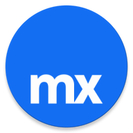

<p align="center">
  
</p>
<h3 align="center">
  Make it Native
</h3>
<p align="center">
  Welcome to the Make it Native App repository! The Make it Native app is a powerful tool designed to streamline the development process for Mendix Studio Pro users. This app allows you to run your Mendix mobile applications directly on your device without needing a build, facilitating a smoother and faster development cycle.
</p>

<div align="center">

[](https://nodejs.org "Go to Node.js homepage")


[](./LICENCE)

</div>

---

#### Table of Contents

- [1 Getting started](#1-getting-started)
  - [1.2 Additional setup requirements](#12-additional-setup-requirements)
    - [1.2.1 Setting up Firebase](#121-setting-up-firebase)
    - [1.2.2 Setting up Google Maps API](#122-setting-up-google-maps-api)
      - [1.2.2.1 Get a Google Maps API key](#1221-get-a-google-maps-api-key)
      - [1.2.2.2 Integrate the API key into your Android project](#1222-integrate-the-api-key-into-your-android-project)
      - [1.2.2.3 Integrate the API key into your iOS project](#1223-integrate-the-api-key-into-your-ios-project)
- [2 Building Application](#2-building-application)
  - [2.1 Fastlane](#21-fastlane)
    - [2.1.1 How to install Fastlane?](#211-how-to-install-fastlane)
  - [2.2 Building application with Fastlane](#22-building-application-with-fastlane)
    - [2.2.1 iOS - Fastlane](#221-ios---fastlane)
      - [2.2.1.1 Building the iOS app for internal testing](#2211-building-the-ios-app-for-internal-testing)
      - [2.2.1.2 Releasing to Test Flight](#2212-releasing-to-test-flight)
      - [2.2.1.3 Releasing to App Store](#2213-releasing-to-app-store)
    - [2.2.2 Android - Fastlane](#222-android---fastlane)
      - [2.2.2.1 Building an apk](#2221-building-an-apk)
      - [2.2.2.2 Building the Android app for internal testing](#2222-building-the-android-app-for-internal-testing)
      - [2.2.2.3 Releasing to Google Play Store](#2223-releasing-to-google-play-store)
    - [2.2.3 Additional Fastlane Options](#223-additional-fastlane-options)
- [3 Set-up developer environment](#3-set-up-developer-environment)
  - [3.1 iOS](#31-ios)
  - [3.2 Android](#32-android)
  - [3.3 Remote debugging](#33-remote-debugging)
  - [3.4 Remote debugging on an Android emulator](#34-remote-debugging-on-an-android-emulator)
  - [3.5 Build from source](#35-build-from-source)
- [4 Sample apps](#4-sample-apps)
  - [4.1 Updating sample app bundles and assets](#41-updating-sample-app-bundles-and-assets)
    - [4.1.1 Android](#411-android)
    - [4.1.2 iOS](#412-ios)
- [5 Generating iOS/Android native bundles and assets](#5-generating-iosandroid-native-bundles-and-assets)
  - [5.1 Using Native Builder UI (also creates native apps to use for testing)](#51-using-native-builder-ui-also-creates-native-apps-to-use-for-testing)
  - [5.2 Using Studio Pro in Dev Mode](#52-using-studio-pro-in-dev-mode)
  - [5.3 Bundle and asset location](#53-bundle-and-asset-location)
    - [5.3.1 Android bundle](#531-android-bundle)
    - [5.3.2 Android assets](#532-android-assets)
    - [5.3.3 iOS bundle](#533-ios-bundle)
    - [5.3.4 iOS assets](#534-ios-assets)
- [6 FAQ](#6-faq)
  - [6.1. Android syncing breaks](#61-android-syncing-breaks)
    - [6.1.1 A dependency is missing or is falsly imported (developer error)](#611-a-dependency-is-missing-or-is-falsly-imported-developer-error)
    - [6.1.2 Android studio fails to load the NPM modules](#612-android-studio-fails-to-load-the-npm-modules)
    - [6.1.3 Windows long path limitation](#613-windows-long-path-limitation)
    - [6.1.4 Android NDK cannot be found](#614-android-ndk-cannot-be-found)
- [License](#license)

---

## 1 Getting started

1. Clone the repository

```bash
git clone https://github.com/mendix/make-it-native.git
```

2. Navigate to the project directory

```bash
cd make-it-native
```

3. Install dependencies

```bash
npm install
```

4. Install pods

```bash
cd ios && pod install
```

### 1.2 Additional setup requirements

To build and run the mobile application successfully, you must complete several setup steps related to external services like Firebase and Google Maps. Follow these instructions carefully:

#### 1.2.1 Setting up Firebase

1. Create a Firebase Project:
   - Go to the [Firebase Console](https://console.firebase.google.com/) and create a new project.
2. Add Your App to the Firebase Project:
   - For Android, add an Android application and follow the instructions.
   - For iOS, add an iOS application and follow the instructions.
3. Download Configuration Files:
   - For Android, download the `google-services.json` file.
   - For iOS, download the `GoogleService-Info.plist` file.
4. Place Configuration Files in Your Project:
   - For Android, move the `google-services.json` file to the `android/app` directory.
   - For iOS, move the `GoogleService-Info.plist` file to the `ios/DeveloperApp` directory.

#### 1.2.2 Setting up Google Maps API

##### 1.2.2.1 Get a Google Maps API key

Follow the instructions provided by Google [here](https://developers.google.com/maps/documentation/android-sdk/get-api-key) to obtain an API key.

##### 1.2.2.2 Integrate the API key into your Android project

Open your `android/app/src/main/AndroidManifest.xml` file and find the section with the placeholder {{GEO_API_KEY}}. Replace {{GEO_API_KEY}} with your actual Google Maps API key:

```xml
<meta-data android:name="com.google.android.geo.API_KEY"
         android:value="YOUR_API_KEY_HERE"/>
```

##### 1.2.2.3 Integrate the API key into your iOS project

To run iOS fastlane script containing an API key please define the variable `GOOGLE_MAPS_API_KEY` before beta lane. If you run it manually in XCode, change the Api key in `ApiKeys.xcconfig` file.

## 2 Building Application

Once you have completed the additional setup requirements, you can proceed
with building your application. You can use Fastlane for building the apps.

### 2.1 Fastlane

#### 2.1.1 How to install Fastlane?

Fastlane is an all in one CI tool that automates the process
of building and deploying.

- Install fastlane by gem
  `sudo gem install fastlane -NV`
- Add this lines in ~/.bash_profile or ~/.zshrc (point the version to version installed)

```bash
export FASTLANE_PATH="/usr/local/lib/ruby/gems/2.6.0/gems/fastlane-2.134.0/bin"
export PATH="$FASTLANE_PATH:$PATH"
```

### 2.2 Building application with Fastlane

#### 2.2.1 iOS - Fastlane

The configuration for Fastlane resides in `/ios/fastlane/Fastfile`. For more
information please check the [README](./ios/fastlane/README.md)

**For the Beta and the Release lane, before building, the VERSION_NUMBER in the `Fastlane` config file needs to be changed manually!**

##### 2.2.1.1 Building the iOS app for internal testing

- Change directory into `/ios`
- `fastlane internal`

The output is in `/build/internal/output`

##### 2.2.1.2 Releasing to Test Flight

Change the VERSION_NUMBER in the `Fastlane` config file to the new version to build.

- Change directory into `/ios`
- `fastlane beta`

**The script will take considerable amount of time as it also waits for processing to finish, to release a Testflight beta test.**

##### 2.2.1.3 Releasing to App Store

Change the VERSION_NUMBER in the `Fastlane` config file to the new version to build.

- Change directory into `/ios`
- `fastlane release`

**The script will take considerable amount of time as it also waits for processing to finish, to release a Testflight beta test.**

#### 2.2.2 Android - Fastlane

The configuration for Fastlane resides in `/android/fastlane/Fastfile`.
For more information please check the [README](./android/fastlane/README.md)

##### 2.2.2.1 Building an apk

- Change directory into `/android`
- `fastlane local`

The output is in `/artifacts`

##### 2.2.2.2 Building the Android app for internal testing

- Change directory into `/android`
- `fastlane internal`

The output is in `/artifacts`

##### 2.2.2.3 Releasing to Google Play Store

- Change directory into `/android`
- `fastlane promote_to_production`

The output is in `/artifacts`

#### 2.2.3 Additional Fastlane Options

For more Fastlane options, please consult the documentation provided.
For iOS, see the [README](./ios/fastlane/README.md),
and for Android, refer to the [README](./android/fastlane/README.md).

## 3 Set-up developer environment

### 3.1 iOS

iOS application require XCode, we assume you have the latest installed and ready to go.
We are using Cocoapods to manage the iOS dependencies.

To install cocoapods on your system, if you have not already:

- Run `sudo gem install cocoapods`

Install npm dependencies:

- Run `npm i`

Clean install the podfiles:

- Run `npm run ios:clean-pod-install`

Install provision profile and certificates

- Run `npm run ios:dev`
- Enter your machine password

Finally, open the project via the `*.xcworkspace` file **not** the `xcodeproj`.

### 3.2 Android

- Install a recent Android Studio
- Open the project in `android` as existing project or import it as Gradle project
- [Update or install a rescent SDK](https://developer.android.com/studio/intro/update#sdk-manager)
- [Install a rescent NDK](https://developer.android.com/studio/projects/install-ndk)
- Switch the Build Variant in Android Studio (on the bottom left side) to `developerappDebug` if it does not default to it
- Start a gradle sync
- If all goes well the green play button should be usable

### 3.3 Remote debugging

- Fill host with <your_ip>:8080 (you can use `localhost:8080` if you're running in an emulator/simulator)
- Check the "Enable dev mode checkbox/switch
- When the app loads, open the app menu:
  - If you are running on a physical device: 3-tap long press or shake
  - If you are running on an iOS emulator: press ctrl+cmd+z
  - If you are running on an Android emulator: press cmd+m (on Mac)
- Press "Enable remote debugging" from the menu
- After the Chrome screen pops up, change its url to `localhost:8083/debugger-ui/`.

### 3.4 Remote debugging on an Android emulator

You cannot use `localhost`, as it points to the Android simulator, instead of the host machine.
To work around this either:

- Use `10.0.2.2:8080` as the URL

- Run `adb reverse tcp:8080 tcp:8080` and `adb reverse tcp:8083 tcp:8083` from your console

### 3.5 Build from source

Building from source is required to be able to debug React Native specific code.
Building from source can be done as following:

- Check out the react native repo `https://github.com/facebook/react-native.git`
- Copy paste the Package folder into the developer app's `node_modules/react-native` folder
- Toggle `BUILD_RN_FROM_SOURCE=true` in `gradle.properties`
- Clean and build app.

## 4 Sample apps

### 4.1 Updating sample app bundles and assets

#### 4.1.1 Android

In `android > app > src > main > assets` (from here on referred to as "A"):

There is a `sampleapps.zip` file. Once decompressed you will find folders representing sample apps. Each folder's name
can be arbitrary, but it must match up with an `id` from `sample_apps.json` in (A) folder. The file
`sample_apps.json` file describes each sample app and has information about/for the sample app. Follow the steps below
to update the Android developerapp bundle and assets:

1. Unzip the `sampleapps.zip`
2. Find the folder for the sample app you want to update - reference `sample_apps.json`. `cd` to this folder
3. In `assets` folder, replace `index.android.bundle` with the file located in 7.3.1
4. In `assets` folder, delete all other folders (and any files) and replace with contents located in 7.3.2
5. App thumbnail can be updated by substituting the existing splash.png file located in the app's root folder.
6. Zip the app folders by selecting all of them and then zip all app folders; rather than zipping the parent directory. Zipped folder should be called `sampleapps.zip`. Note: make sure that the root content of the `.zip` is each sample app folder
7. In "A", open `sample_apps.json` and bump the version

See Section 5 for details on generating a project's bundles and assets.

#### 4.1.2 iOS

In `ios > DeveloperApp > SampleApps > Bundles`:

There are folders that represent each sample app. The folder name can be arbitrary. The `config.json` file describes
each sample app and each object's `id` property matches the folder name and details information about/for the sample app.

1. Find the folder for the sample app you want to update - reference `config.json`. `cd` to this folder
2. Replace the `index.bundle` file with the updated one from 7.3.3. Note: make sure to rename the filename to "index.bundle" as it is usually "index.ios.bundle"
3. Clean the contents of the `assets` folder
4. Copy all content from 7.3.4 into the `assets` folder

See Section 5 for details on generating a project's bundles and assets.

## 5 Generating iOS/Android native bundles and assets

### 5.1 Using Native Builder UI (also creates native apps to use for testing)

1. In Studio Pro, click `App > Build Native Mobile App`
2. Click "Configure app for local building"
3. (Build type) Select a disk location for the native app source code
4. (Build type) Disable GitHub and App Center cloud services
5. (Splash screens / App icon / Custom fonts) Use the default splash screen and app icons and no custom fonts (because we need the JavaScript bundle and project assets, this step isn't important but required)
6. (App details) Select "Portrait" and "Landscape" for app's "orientation selection"
7. (App details) Select "Phones" and "Tablets" for app's "Device targets selection"
8. (App capabilities) Disable all capabilities
9. (App capabilities) If your project contains a widget or action that requires a Google API key, add it.
10. (Configure app locally) Enter in a version number
11. (Configure app locally) Enter in a runtime URL - if you want to test the native app, enter an appropriate runtime URL
12. Click "Configure locally"

The native app's source code will be in the disk location selected in step 3. In your Mendix Project directory, in
`deployment > native > bundle` there will be both the android and iOS bundles and assets.

### 5.2 Using Studio Pro in Dev Mode

1. Add `--enable-dev-mode` in the launch options for Studio Pro executable
2. In the DEV menu at the topbar, under `NativeUI`, click `Native Packager settings` then enable the native bundles to be created during deployment.
3. Run the Mendix project

In your Mendix Project directory, in `deployment > native > bundle` there will be both the Android and iOS bundles and assets.

### 5.3 Bundle and asset location

In your Mendix project folder:

#### 5.3.1 Android bundle

In `deployment > native > bundle > android > assets > index.android.bundle`

#### 5.3.2 Android assets

In `deployment > native > bundle > android > res > (all folders and files)`

#### 5.3.3 iOS bundle

In `deployment > native > bundle > iOS > index.ios.bundle`

#### 5.3.4 iOS assets

In `deployment > native > bundle > iOS > assets > (all folders and files)`

## 6 FAQ

### 6.1. Android syncing breaks

There are a number of reasons why syncing would fail:

#### 6.1.1 A dependency is missing or is falsly imported (developer error)

We are trying to keep master working, but something might go wrong from time to time.
The build logs should point exactly to the offending files, fix the issue and resync.

#### 6.1.2 Android studio fails to load the NPM modules

If the project explorer does not list any of the npm modules imported, two things might be ammiss:

- `npm i` has not been ran yet
- Android studio caches are borked

First one is obvious, for the later, try:

- `File -> Invalidate Caches / Restart`
- `Build -> Clean Project`

As a last resort, delete the following folders relatively to the project's directory:

1. Delete the `.gradle` folder
2. Delete the `.idea` folder
3. Delete both `build` folders in `/app` and `/mendixNative`
4. Restart android studio and open the project

#### 6.1.3 Windows long path limitation

When building on windows, the NDK build step generates huge paths that might break the build.
A possible indication is errors in the form of can't find directory or file in `c:\<huge path>`.
To fix this:

1. Open the top level `build.gradle` file
2. Search for line `allProject { ... }`
3. Add `buildDir = c:/tmp/${rootProject.name}/${project.name}` after the first `{`

From now on the output of the builds is being generated in the build dir provided. So if you are looking for the generated apks look there.

#### 6.1.4 Android NDK cannot be found

For errors that point to the React Native gradle files or native compilation, React Native can't probably find your NDK installation.
The easiest way to fix it is to add the path to the NDK to your `PATH`:

Open `~/.bash_profile` or `~/.zshrc`:

```bash
export ANDROID_NDK="~/Library/Android/sdk/ndk/*add-your-ndk-version-number*"
export PATH=$PATH:$ANDROID_NDK
```

## License

Make it Native is open source software licensed under the [Apache-2 license](./LICENCE).
